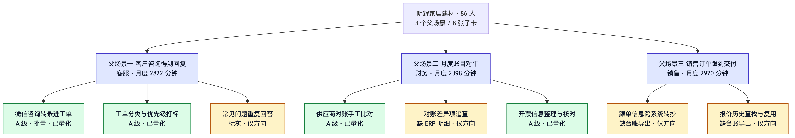
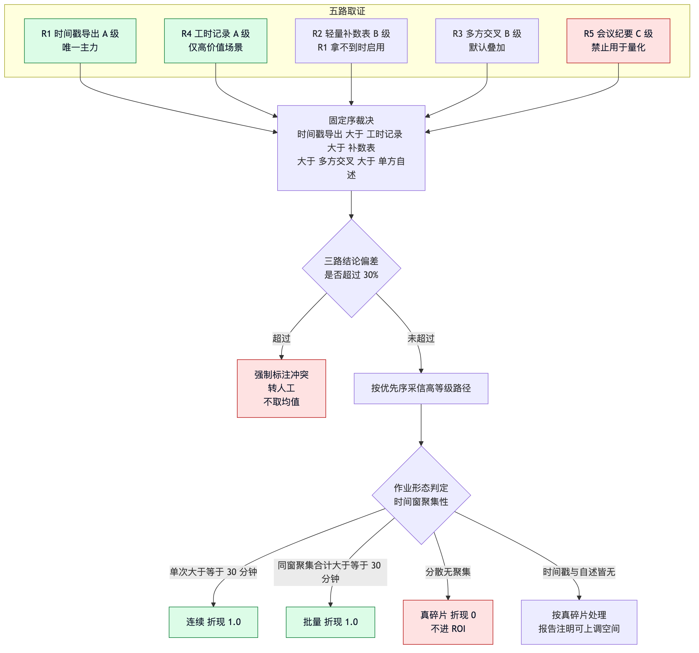
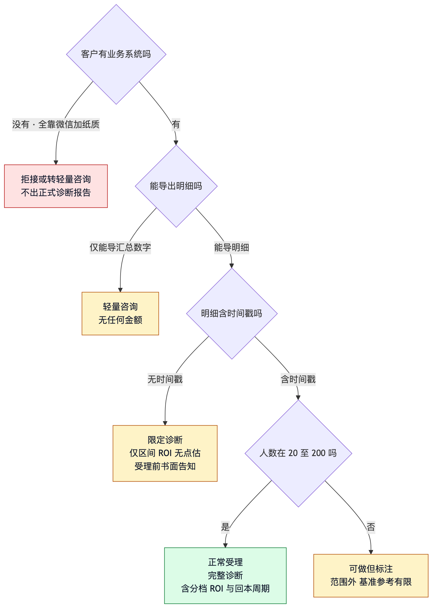

# 01 方法论

> 面向业务负责人与顾问。只讲判断口径，不讲实现。

## 分析单元是任务，不是岗位

这是整个项目最重要的单一决策，后面所有设计都由它推出。

「客服很忙」不可操作。「客服每月把 428 条微信咨询手工转录进工单，单条 4.06 分钟」
才可估算、可验证、可落地。岗位粒度只能得出「要不要裁人」，任务粒度才能得出
「先自动化哪一步」。

场景是两层结构：父层用业务结果说话，给老板看；子层用操作序列说话，可估算、可自动化。

子层切分判据：**操作者不变、涉及系统不变、可一次性自动化**，算一个场景。客服连续完成
转录加打标算一个；若转录由客服做、打标由主管做，则算两个——跨人即拆。

数量规则是父层选最痛的 2–3 条，**子层在父层内穷尽**。这样依赖关系天然闭合在父层内部，
不会出现「先做 B，但 B 的前提不在报告里」的悬空。



## 自述数字不能直接用

问一线「你每天花多少时间做这个」，拿到的数字有系统性偏差：员工不知道真实数字、
倾向夸大痛点、描述的是理想流程而非实际流程。人类顾问靠跟岗和翻单据校正，
Agent 无法跟岗，因此必须多路互校。

五路取证，等级与定位都不同：

| 路径 | 手段 | 等级 | 定位 |
|---|---|---|---|
| R1 时间戳导出 | 工单 CSV、表格修改记录、系统日志 | A | 唯一主力 |
| R2 轻量补数表 | 5–8 个纯数字填空，不做多轮追问 | B | R1 拿不到时启用 |
| R3 多方交叉 | 同一流程取两个以上不同角色所出材料 | B | 默认叠加 |
| R4 工时记录 | 客户配合记录 3–5 个工作日 | A | 仅高价值场景 |
| R5 纪要类文档 | 会议纪要、反馈收集文档 | C | 只识别有哪些流程，**不得用于量化** |

R5 被刻意压到 C 级并禁止量化：纪要记录的是决策与结论，不是操作机制。它会写
「决定优化客服响应流程」，不会写「转录一条平均 3 分钟、每天 40 条」。
静态文档缺什么就永久缺什么，无法追问。



**冲突不取均值。** 三路结论偏差超过 30%（`FROZEN["conflict_threshold"]`）时标注冲突并转
人工。裁决按固定序，不由模型自由决定（`FROZEN["adjudication_order"]`）：

```
时间戳导出 > 工时记录 > 补数表 > 多方交叉 > 单方自述/纪要
```

取均值会把分歧掩盖掉，而分歧本身是最有价值的信号。

## 证据等级决定能说什么

| 等级 | 判定 | 能给什么 |
|---|---|---|
| A | 单据痕迹或系统数据支撑 | 点估 + 区间 |
| B | 多方交叉且至少一路有客观痕迹 | 仅区间 |
| C | 单方陈述或基准外推 | 仅方向性判断，**无任何金额** |

B 级的定义刻意收紧：纯自述的多人互证只能到 C 级，因为多人可能只是印证了同一个
组织性偏差。

## 作业形态：判据是聚集性，不是单次时长

这是整套方法论里最容易做错的一处。

| 形态 | 判据 | 折现 |
|---|---|---|
| 连续作业 | 单次连续 30 分钟以上 | 100% |
| 批量作业 | 多次操作聚集在同一时间窗，窗内合计 30 分钟以上 | 100% |
| 真碎片 | 操作分散全天不同时刻，无聚集性 | **不进 ROI**，仅定性描述 |

按「单次时长不足 30 分钟就是碎片」的旧规则，10 次录入一口气做完会被当成碎片折掉，
而它恰恰最该自动化。10 次分散全天是真碎片，10 次一口气做完是实质连续 30 分钟——
两者单次时长相同，正确判据是**是否在同一时间窗内连续发生**。

这条错误有一个失败重放用例钉着（`evals/failure_replays/`），修法就是把判据从单次时长
改成时间窗聚集性。

判定必须用证据不能用自述：主判据是单据与系统时间戳分布；自述入口保留但只作参考；
两者差异极大时标冲突转人工；皆无则按真碎片处理，并在报告注明「若为批量作业收益可
上调多少」，把不确定性显式留给客户校正。

## ROI 的四条纪律

公式冻结在 `FROZEN["roi_formula"]`：

```
折现后月度工时 = 月度工时 × 折现系数(作业形态)
月度收益       = 折现后工时/60 × 小时综合成本 × 自动化率
净收益         = 折现后收益 − 实施成本
回本月数       = 实施成本 / 月度净收益
```

**一、假设不透明的 ROI 等于没有 ROI。** 人力成本单价用区间 + 公开行业薪酬基准，
六项关键假设写在报告首页可直接替换。按岗位分档，不用全公司均值——均值会高估一线、
低估管理岗。

**二、实施成本必须计入并给区间。** 含工具订阅费、集成人力、培训磨合、持续维护。
集成人力通常是订阅费的数倍，不计入客户落地后会觉得被骗。

**三、依赖收益先去重再相加。** 分别计算会重复计上同一份收益，导致总数虚高。规则是
只计入独立可实现部分，依赖收益单列。报告**显式展示去重前后差额**，防止客户自行加总
得出更大数字。预置案例实测：直接相加 4,116.72 元，去重后 2,516.72 元，差额 1,600 元。

**四、三档口径分别对应不同证据强度。** 保守档只计已验证的直接工时节省，始终给；
中性档乘 1.15 效率提升系数，A/B 级给；乐观档乘 1.35，仅 A 级且客户明确要求时给
（系数取自 `roi.py` 的 uplift 常量）。

**行业基准只做横向对照，不填 ROI 空缺。** 正确形式是「你们这个环节每单约 5 分钟（实测），
行业常见区间 2–4 分钟（基准，附出处与日期）」。缺口仍标为缺口——基准冒充实测是
ROI 幻觉的主要来源。

## 落地难度七维

权重固定在 `feasibility.DIMENSIONS`，每维取值 1–5：

| 维度 | 权重 |
|---|---|
| 数据可得性 | 0.22 |
| 系统集成度 | 0.18 |
| 流程标准化程度 | 0.16 |
| AI能力匹配度 | 0.16 |
| 人员接受度 | 0.14 |
| 合规风险 | 0.08 |
| 维护成本 | 0.06 |

**返回分项与缺失项，不返回单一总分。** 单一总分会掩盖「这个场景难在数据拿不到」与
「难在人不接受」的区别，而两者的应对完全不同。运行时不可新增维度，权重变更须人工
批准并发版。

## 「不做」象限必须保留

顾问价值的一半在于告诉客户哪些别碰。四象限的行动语义必须写出来，不能只画图：
高收益低难度是先做，高收益高难度是规划并拆阶段，低收益低难度是顺手做，
低收益高难度**明确写出不建议做及理由**。

这也是防止报告退化成「什么都能上 AI」推销材料的结构性约束。预置案例里跨系统编排
场景就落在这个象限，理由是维护成本高且客户提到可能更换 ERP。

## 客户准入边界

不是所有客户都该接。这一条从商业选择升级成了质量前提：连基础导出都拿不出的客户，
必然只能产出无金额的报告，做了就是砸口碑。



| 客户状态 | 处理 | 交付形态 |
|---|---|---|
| 能导出明细含时间戳 | 正常受理 | 完整诊断，含分档 ROI 与回本周期 |
| 能导明细但无时间戳 | 受理并事前书面告知 | 限定诊断，仅区间 ROI，无点估 |
| 仅能导汇总数字 | 仅接受轻量交付 | 轻量咨询，无任何金额 |
| 无任何系统 | 拒接或转轻量咨询 | 不出正式诊断报告 |

拒接不是损失。这类客户的真实需求是先把流程数字化，流程本身没成型时上 AI 会放大失能。

规模定在 20–200 人：20 人以下流程未成型、缺少可自动化的重复量；200 人以上应做部门级
诊断而非全公司。超范围可以做，但标注「范围外，基准参考有限」，不拒绝。

## 效果衡量：证明改造有用，不是只给预测

诊断给的是「预计可省」，效果衡量回答「实际省了吗」。规则写死在 `measure.py`：

| 采信（过程指标） | 不采信（经营结果指标） |
|---|---|
| 该环节处理时长 | 营收 |
| 该环节处理单量 | 利润率 |
| 该环节返工率、错误率 | 人力成本占比 |

经营结果指标波动原因太多，拿它校准场景识别会训出错误关联。

**必须有改造前基线**，无基线时接口返回 422 并指出补基线的路径，绝不给一个看起来很好的
改善率。方向按指标语义判定：处理时长降低是改善，处理单量升高才是改善。样本量低于 20
标注低置信。基线不可变，重复记录产生新版本并保留前版。

归因诚实说明：没有反事实对照，无法证明省下的工时全部来自这次改造。因此质量主力信号
放在零延迟的即时反馈上，而不是三到六个月后的回访。

## 本期不做的事

- 不做通用 BI 报表或流程挖掘平台，只做提效场景识别
- 不替客户做落地实施，交付物是诊断报告与路线图
- 不点名推荐具体 AI 产品，只给能力类型与选型标准
- 不向客户业务系统写入任何数据
- 不采信经营结果指标
