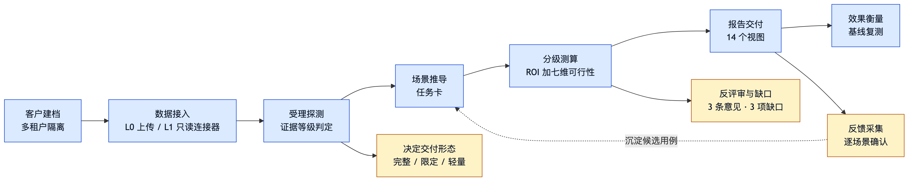
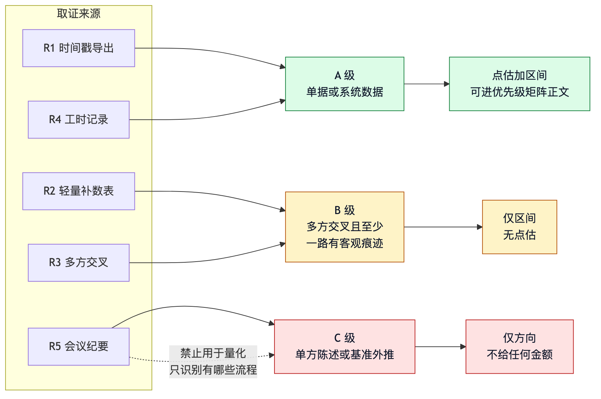

# 02 产品能力

> 面向产品、顾问与客户方决策者。只讲能力与边界，实现见 [03 架构](03-架构.md)。

顾问是直接使用者，客户老板是报告读者。系统不面向客户自助使用。



顾问的实际工作流：

```
新建客户 → 接入数据 → 开始诊断 → 读报告 → 记基线 → 改造 → 复测
          ├ L0 拖拽 CSV
          └ L1 连接器同步
```

## 1. 客户建档与多租户隔离

同一套方法论服务多个客户，客户之间互不可见。

- 建档填名称、行业、人数、覆盖部门。人数超出 20–200 不拒绝，但标注「基准参考有限」
- 工作区、证据台账、报告、连接器凭据按客户物理隔离，跨客户读取在框架层被拒
- 客户标识做路径穿越防护，恶意名称无法逃出工作区目录
- 删除客户不可逆，界面逐条列出会被删掉的内容（材料、证据台账、已记基线、连接器凭据），
  默认焦点在「取消」

## 2. 数据接入双轨

两条轨道**并行**，不是二选一。同一客户可以 L0 打底、L1 补强。

| 档位 | 形态 | 什么时候用 |
|---|---|---|
| L0 手工导入 | 拖拽 CSV / Excel / PDF / 图片 | 默认档，零集成成本 |
| L1 只读连接器 | 工单 / CRM / IM / ERP / 电商 / OA 审批 | 客户 IT 配合、需周期性取数 |

L1 拿到的客观计数还用来校验客户自述口径——这是「单据考古」的自动化版本。同一活动两路
偏差超过 30% 时标注冲突并转人工。

### 连接器目录：26 个模板

按**具体产品**建模，不按抽象类别。顾问接客户时听到的是「我们用钉钉」，不是
「我们用企业 IM」。目录取自 `connectors.list_specs()`：

| 类别 | 厂商模板 | 等级上限 | 说明 |
|---|---|---|---|
| 工单 | Zendesk · Udesk · Jira Service Management | A | 含创建/首响/解决多个时间戳，最容易拿到 A 级 |
| 电商 | 有赞 · 微盟 · 淘宝天猫 · Shopify | A | 订单含下单与支付时间戳 |
| CRM | Salesforce · 销售易 · HubSpot | A | 跟单活动记录 |
| OA 审批 | 钉钉 · 飞书 · 企业微信 | A | 审批实例有提交与完成双时间戳 |
| ERP | 金蝶 · 用友 · 管家婆 | B | 多数部署不开放操作时间戳，ROI 只给区间 |
| IM | 企业微信 · 钉钉 · 飞书 | C | 三家都不开放聊天记录批量导出，只有会话量汇总 |

合计 19 个厂商模板 + 5 个抽象类别模板（客户系统不在清单里时兜底）+ 2 个演示数据源
（固定种子，没有真实客户系统也能跑通全链路）= 26 个。

**为什么把 OA 审批从 IM 里拆出来单列：** 同一个钉钉，聊天记录拿不到（C 级），但审批实例
有完整时间戳（A 级）。混成一类会抹平这个差异，进而误判可量化性。IM 刻意声明为 C 级——
标成 A 级会让下游误以为能量化，最终变成 ROI 幻觉。测试逐个断言「声明 A 级就必须真的
拿到时间戳」。

界面是**两级菜单**：一级只给类别卡片 + 品牌标识（26 张卡全铺开没法看），点进类别才展开
产品明细——只读范围、能算的指标、拿不到什么、接入步骤都在二级，可搜索。

每个模板带接入步骤与官方文档链接，顾问可照着向客户 IT 申请权限。**全部标注 `verified=false`
与待核对说明**：编造 scope 名或夸大 API 能力，会让顾问按错误信息去申请权限、白跑一趟。
落地前请按客户实际版本复核官方文档。

## 3. 受理前材料探测

在投入前锁定交付形态，把「事后发现产出平庸」变成「事前约定交付边界」。客户常说
「我们有工单系统」，实际导出却只有汇总数字——这时报告已经开工。所以探测提到正式受理
之前，只需一份任意 7 天的样本导出。



| 探测结果 | 可达等级 | 处理 |
|---|---|---|
| 有单条记录 + 时间戳 | A 级可达 | 正常受理，完整诊断 |
| 有明细、无时间戳 | B 级上限 | 受理并事前书面告知，耗时需补数表 |
| 仅汇总数字 | C 级上限 | 仅轻量咨询，无任何金额 |
| 导不出结构化数据 | 不可达 | 拒接 |

同时做安全校验：含宏文件（`.xlsm` `.xlsb` `.docm` `.pptm`）直接拒收，Excel 公式只取值不
求值，类型白名单外不受理，单文件上限 20MB、单批 40 份。

## 4. 场景推导

从材料痕迹推出任务卡：**数字由时间戳聚簇算出，模型只负责命名。**

每张子场景卡固定包含场景名、操作者、涉及系统、现状描述、频次 × 单次耗时得月度工时、
证据等级、作业形态、收益构成、AI 介入方式、预期效果、依赖关系、落地依赖、证据引用。
**无证据引用的卡直接拒写。**

切分判据与作业形态三分见 [01 方法论](01-方法论.md)。

## 5. 分级测算

证据等级决定能说什么，等级不够就不给数字。三档 ROI 口径、依赖去重、七维可行性
见 [01 方法论](01-方法论.md)。每笔 ROI 都摊开计算过程与假设清单。

## 6. 报告交付

左侧导航共 14 个视图：诊断结论 6 页 + 支撑追溯 3 页构成报告主体，另有工作台 3 页
（客户、材料接入、系统连接器）与系统 2 页。

| 页面 | 看点 |
|---|---|
| 概览与假设 | 去重前后差额、六项关键假设（可直接替换）、受理探测结论 |
| 场景清单 | 父子两层，A/B/C 三级证据与三种作业形态并存 |
| 优先级矩阵 | 真散点图，阈值服务端下发，「不做」象限保留并写明理由 |
| 分级 ROI | 每笔摊开计算过程，A 级点估、B 级区间、C 级无金额 |
| 90 天路线图 | 每批次都有验收标准**与失败退出条件** |
| 改造效果 | 改造前基线 vs 改造后复测，无基线不给改善率 |
| 证据台账 | 每条证据的定级理由、样本量、支撑字段、冲突标记 |
| 反评审与缺口 | 独立视角的最强反驳 + 未获取材料及其影响 |
| 经验判断 | 物理隔离的专家判断区，无任何金额，**每条标明来源** |
| 运行简报 | 内部指标翻译成人话、注入拦截计数、反馈入口 |
| 术语与标准 | 44 个术语 + 六张分级标准表 |

优先级矩阵是**真散点图**：x 轴七维加权难度、y 轴月度收益，两条分界线来自 `/api/matrix`
下发的 `thresholds`。收益线取本客户已量化场景收益的中位数（预置案例 304.74 元/月），
难度线取七维加权 1–5 的中点 3.0——绝对阈值会随客户规模失准。**象限归属由服务端判定**，
前端只负责画在对应格子里，否则前端自算一套阈值，图上的点会和文字结论互相矛盾。

**专家判断区与数据结论物理隔离。** 顾问的真实价值恰在证据不足但判断准的洞察，严守证据链
会把这类洞察全删掉，产出无懈可击的平庸报告。解法是物理分区而非降低标准：这一区强制
标注「基于经验的判断，无数据支撑」、写明建议验证方式、**不得出现任何金额**，且每条必须
标明来源（`curated` 顾问定稿 / `llm` 模型现场生成 / `fallback` 回退）——这一区按设计无数据
支撑，来源就是读者唯一的可信度线索。

## 7. 效果衡量

见 [01 方法论](01-方法论.md)。核心：只采信过程指标，必须有改造前基线。

## 分层呈现：同一份数据服务三类读者

| 读者 | 看到什么 | 不看到什么 |
|---|---|---|
| 客户老板 | 每场景一句话结论、可省金额区间、建议优先级 | 内部阶段号、工具调用、检索细节 |
| 客户一线 | 场景卡的现状描述与量化、反馈入口 | 其他部门的成本假设 |
| 交付顾问 | 全部 14 页，含证据台账、冲突项、缺口清单、运行简报 | 无限制 |

## 易懂性：术语可查、分级标准可见

完全不用术语不现实——「证据等级」「作业形态」是交付物的骨架，删掉就没法表达结论强度。
所以分两类处理：

- **18 个内部实现词一律不上界面**（`glossary.INTERNAL_ONLY`）：`insufficient_data`、
  `no_grounding`、`schema`、`tenant`、`playbook`、`S0–S5`、`metric_probe` 等，由测试静态
  扫描 `web/` 把守。材料角色 `R1–R5` 同理，界面只写「带时间的明细导出 —— 首选，可达 A 级」，
  编号仅作为 value 传回服务端
- **44 个领域术语保留但必须可查**，按 8 个主题分组。每个词写两件事：一句话解释（≤120 字）
  与「为什么这个词值得你关心」。只说「它是什么」不够——用户真正需要知道的是这个词会
  怎么影响他要做的决定

七个查词入口：正文虚线下划线的词、等级徽标（点开整张标准表并高亮当前级）、难度值
（点开七维权重表）、严重度徽标（点开三档标准**与该怎么办**）、ROI 表头（点开三档口径差异）、
侧栏图例、术语页搜索。

服务端下发的整段中文也自动接上查词入口。关键假设、裁决优先级、反评审隔离说明这些段落
术语密度最高、最需要查词，前端拿到的却是纯字符串。`autoTerm()` 三条纪律：
**先转义再注入**（这些段落含客户名与文件名，属外部输入，顺序颠倒等于把客户材料当 HTML
执行——这是安全属性）、长词优先匹配（「连续作业」必须在「作业形态」之前）、每段只标第一次。

术语表拉不到时退回纯文本，报告照样能读——查词是辅助，不该成为单点故障。

六张标准表：证据等级 A/B/C、作业形态与折现、落地难度七维、交付形态、ROI 三档口径、
反评审严重度。每张都写明判定标准以及**这一级能给什么、不能给什么**——「B 级」不说明
「只给区间不给点估」，等级本身对用户没有意义；「严重度 高」不说明该怎么办，就只是在吓人。

**分级标准只有一处真值**，不在前端另写一份：七维权重取自 `feasibility.DIMENSIONS`、
ROI 三档系数取自 `roi.py` 的 uplift 常量、严重度档位取自 `agents._SEVERITIES`，
三者都有测试断言两边一致。否则改了实现、界面继续显示旧数字，那是在骗人。

## 无障碍与交互细节

全部经浏览器实测并有静态测试防回归，细节见 [04 结论纪律](04-结论纪律.md)。要点：

- 色彩对比度达 WCAG AA（小字 4.5:1），且取值定在**落到任何一层背景上都达标**
- 术语控件是 `<button>` 而非 `<span>`：可 Tab 聚焦、可 Enter 打开、读屏可识别
- toast 是 live region，否则读屏用户完全收不到「已上传 3 份材料」这类唯一反馈
- 提供「跳到主内容」：左侧 14 个导航条目，键盘用户每换一页都要 Tab 穿过全部条目
- 宽表表头吸顶：ROI 与证据台账都是 8 列，往下翻两屏就忘了这一列是什么
- 弹窗焦点管理：打开前记录焦点、关闭后还回，Tab 与 Shift+Tab 都圈在弹窗内
- 按 `prefers-reduced-motion` 全局关闭动画
- 换页加载态延迟 250ms 再出现：数据大多命中缓存，立刻显示骨架屏反而会闪一下
- 慢请求后到不覆盖当前页面（异步渲染最典型的竞态）
- 不可逆操作用应用内确认框，不用原生 `confirm()`

界面截图见 [docs/screenshots/](screenshots/)。

## 开放性

- 全部诊断数据经 28 个接口对外提供，前端只是其中一个消费者
- 报告结构化落盘为 `REPORT.json`，可被下游 BI 或客户自有系统取用
- 术语表与六张标准表独立成接口，可被其他交付物复用
- 反馈接口对任何角色开放，角色必填

## 能力边界

- 不做落地实施，不生成自动化脚本或机器人流程
- 不向客户系统写入，全部连接器只读且在框架层强制
- 不点名推荐产品，默认只给能力类型与选型标准
- 不做通用报表平台，指标口径围绕提效诊断固定
- 连接器模板的权限范围与接口能力标注为待核对
- 客户原始数据不进任何知识库索引，因此不支持跨客户检索历史客户业务事实
- **当前服务无内置鉴权**，部署到可公网访问的环境必须在反向代理层加认证，
  见 [07 安全与合规](07-安全与合规.md)
