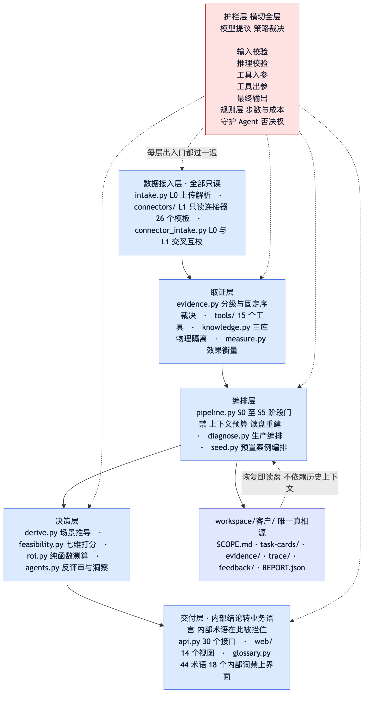
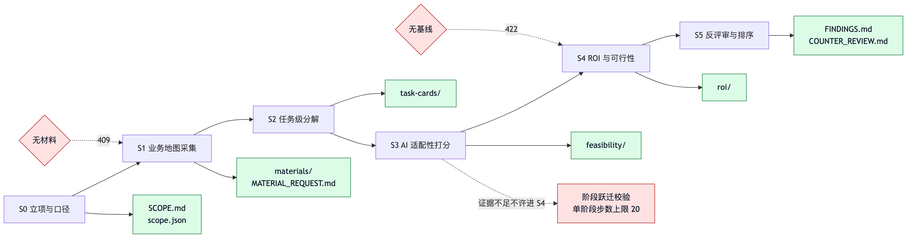
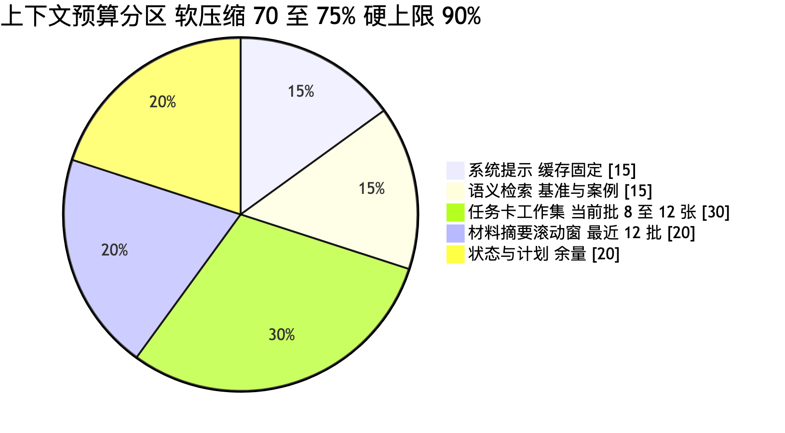
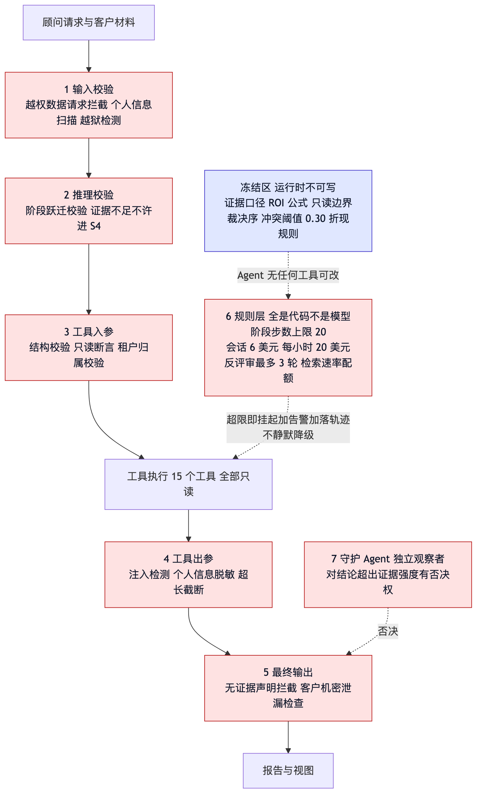
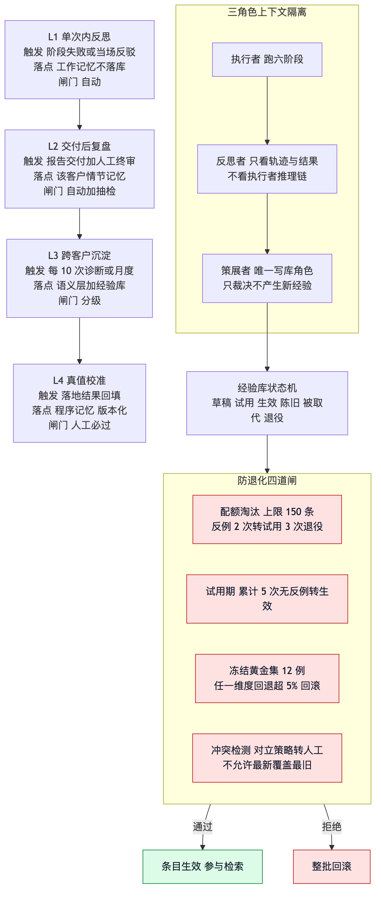
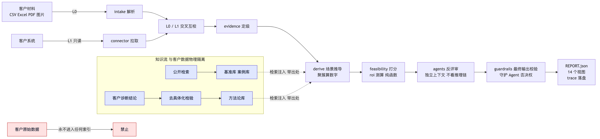

# 03 架构

> 面向研发与架构评审。对应 `aiea` v1.0.0，29 个模块 9,538 行，32 个测试文件 540 条用例。
> 设计依据：Anthropic《Building Effective Agents》《Effective Context Engineering》
> 《Writing Tools for Agents》、OpenTelemetry GenAI 语义约定（`gen_ai.*`, semconv 1.44）、
> Reflexion（arXiv 2303.11366）、ACE（arXiv 2510.04618）。

## 定级与总述

架构定级 **Tier 2.5**：Plan-and-Execute 骨架 + 局部 ReAct，不是 Tier 3 自由 Agent。
诊断流程本身可以预先写死，只有材料缺口判定与跨源证据拼接需要模型自由发挥。
Plan-and-Execute 额外买到可审计的中间产物，而客户要看的恰恰是「你凭什么这么说」。

自主度定为**只读 + 建议，人工拍板**。渐进路径只作用于流程：人工确认每张任务卡 →
抽检 → 仅审终稿排序。

护栏层**横切全层**，不是夹在中间的一层。落盘是唯一真相源，会话上下文可随时丢弃重建。

| 层 | 职责 | 主要模块 |
|---|---|---|
| 数据接入 | 材料 → 带来源标记的结构化解析结果，双轨只读 | `intake.py` `connectors/` `connector_intake.py` |
| 取证 | 从痕迹反推真实频次与耗时，给证据定级 | `evidence.py` `tools/` `knowledge.py` |
| 编排 | S0–S5 推进、阶段门禁、上下文预算、读盘重建 | `pipeline.py` `workspace.py` |
| 决策 | 场景推导、可行性、ROI、反评审 | `derive.py` `feasibility.py` `roi.py` `agents.py` |
| 护栏 | 七层护栏，模型提议、策略裁决 | `guardrails.py` `config.py` |
| 交付 | 内部结论 → 14 视图 + 结构化报告，内部术语在此拦住 | `api.py` `glossary.py` `web/` |

## 模块落点对照

代码注释里的 `§x.y` 指向 [design/架构设计-v1.2.md](design/架构设计-v1.2.md)。

| 模块 | 行数 | 职责 | 章节 |
|---|---|---|---|
| `config.py` | 103 | 冻结区（只读映射，运行时写入抛错） | §9.7 |
| `models.py` | 295 | 全部数据契约；`ToolResult` 把 `insufficient_data` 做成 `ok=True` 的一等公民 | §6 |
| `evidence.py` | 287 | 分级、固定序裁决（冲突不取均值）、时间戳聚集性判定 | §3、§3.1、§3.2 |
| `roi.py` | 203 | **纯函数**，缺参报结构化错误并指明去哪个工具取；依赖收益先去重再相加 | §6、§11.3 |
| `feasibility.py` | 58 | 七维 rubric，返回分项 + 缺失项，不返回单一总分 | §11.2 |
| `guardrails.py` | 228 | 七层护栏、注入检测、PII 脱敏、tenant 隔离、守护层否决 | §13.1 |
| `knowledge.py` | 243 | 三库物理隔离、`no_grounding`、去具体化检验 | §8.2、§15.2.1 |
| `agents.py` | 316 | 反评审（judge 档，拿不到主 Agent 推理链）与洞察生成 | §5、§14.3 |
| `pipeline.py` | 216 | S0–S5 编排、阶段门禁、按阶段计 `MAX_STEPS`、读盘重建 | §2、§5、§13.1 |
| `telemetry.py` | 227 | `gen_ai.*` 语义约定 + 自然语言简报 | §10 |
| `evals.py` | 188 | 六维记分卡 + 冻结黄金集 12 例 | §14 |
| `clients.py` | 219 | 客户注册表（多租户建档/切换/删除），slug 防路径穿越 | §17.2 |
| `intake.py` | 335 | 受理前探测 + 材料上传解析：类型白名单、禁宏禁公式、注入检测 | §17.1.1、§12.2.1 |
| `derive.py` | 610 | **场景推导**：数字由聚簇算出，LLM 只负责命名 | §11.1、§3.2 |
| `diagnose.py` | 528 | 生产路径的 S0–S5 编排，与 `seed.py` 同 schema | §2 |
| `seed.py` | 927 | 预置演示案例（材料与场景为讲清设计而构造） | — |
| `connectors/base.py` | 316 | **框架层强制只读**、凭据隔离、能力声明、速率配额 | §4、§13.3 |
| `connectors/vendors.py` | 645 | 19 个厂商模板 | §4 |
| `connectors/presets.py` | 342 | 5 个抽象类别 + 2 个演示数据源 | §4 |
| `connector_intake.py` | 303 | L1 拉取转 ParsedMaterial + L0/L1 交叉互校 | §4、§3.1 |
| `measure.py` | 369 | 效果衡量：无改造前基线一律不给改善率 | §19.4、§9.3 |
| `glossary.py` | 453 | 44 个术语 + 六张分级标准表；18 个内部词禁上界面 | §12.1 |
| `api.py` | 722 | 28 个接口 + 12 个指向预置客户的旧路径 | §11 |
| `tools/__init__.py` | 678 | 15 个工具，`ToolResult` 统一结构化返回 | §6 |

## 数据接入层

本层是系统与外部世界唯一的接触面，因此也是**不可信数据的入口**。

设计目标：零集成成本可用（客户不配合 IT 时仍能跑完诊断）、只读边界靠框架层强制而非约定、
不可信输入不得成为指令、探测先于受理。

**L0 手工上传解析**（`intake.py`）：类型白名单 → 宏与公式检测 → 大小与批量上限 →
注入检测 → 解析为带角色标记的结构化材料。含宏文件直接拒收；表格类文件对以 `=` `+` `-` `@`
开头的单元格以及 DDE、HYPERLINK 模式做公式检测，只取值不求值。解析失败不猜测内容，
明确回报读不出来并建议换格式，且不影响同批其他文件。

**L1 只读连接器**（`connectors/base.py`）：能力声明校验 → 只读断言 → tenant 过滤 →
速率配额 → 拉取 → 注入检测。写动词（write/update/insert/delete/patch/post）在
`base.execute()` 就被拒，具体连接器根本没有写入通道。放弃写权限一次性消掉工具滥用、
数据外泄、权限提升的绝大部分暴露面。

连接器声明的证据等级不得高于实际能拿到的粒度，测试逐个校验——这条防的是 ROI 幻觉的源头。
演示数据源的种子用 **blake2b 而非内置 `hash()`**：后者被加盐，重启即漂移，会让同一客户的
数据跨进程变化。

**L0/L1 交叉互校**（`connector_intake.py`）：同一活动两路比对，偏差超 30% 标注冲突并
强制转人工。冲突不取均值。

## 取证层

整套系统的地基：证据等级决定了上层能说什么。五路取证、固定序裁决、作业形态判定的口径
见 [01 方法论](01-方法论.md)，此处只讲实现取舍。

### 15 个工具的设计取向

按 Agent-Computer Interface 原则设计：不是把接口包一层就当工具，要设计的是**一个人类
分析师会怎么切分这件事**。命名统一为动词 + 名词。

| 工具 | 权限 | 关键设计点 |
|---|---|---|
| `scope_define` | 本地写 | 强制含数据基准日、部门边界、数据可得性声明 |
| `material_request` | 读 | 返回材料清单 + 每份能算出什么，不做多轮追问 |
| `document_forensics` | 读 | 单据考古：从单据反推频次耗时 |
| `process_search` | 读 | 跨源检索活动痕迹，只回相关片段 |
| `system_inventory` | 读 | 盘点在用系统与集成缺口，返回语义名而非标识符 |
| `metric_probe` | 读 | 必须返回来源与样本量，取不到返回缺数据标记 |
| `taskcard_upsert` | 本地写 | 结构校验，无证据引用直接拒写 |
| `benchmark_lookup` | 读 | 每条带出处与时效 |
| `capability_match` | 读 | 匹配 AI 能力边界，版本化 |
| `feasibility_score` | 读 | 七维打分，返回分项 + 缺失项 |
| `roi_estimate` | 读 | 纯函数，缺参报结构化错误 |
| `insight_propose` | 读 | 低证据高价值洞察，强制标注为专家判断 |
| `counter_review` | 读 | 独立上下文，输出最强反驳 |
| `outcome_record` | 本地写 | 采集落地结果与用户反馈 |
| `report_render` | 本地写 | 未过验证门禁的场景标灰，不入正文 |

三个非显而易见的取舍：

**一、`metric_probe` 必须能理直气壮地说取不到。** 默认模型被训练成要给答案，所以
「没有数据」必须是成功返回值的一等公民而不是异常。代码里把 `insufficient_data` 做成
`ok=True` 的返回形态，避免被上层的宽泛异常捕获吞掉。

**二、`roi_estimate` 纯函数化**，不许自行「合理估计」缺失基线。缺参就报结构化错误并指明
去哪个工具取。工具层挡住的幻觉，胜过提示词里叮嘱十遍。

**三、返回语义名而不是标识符。** 可显著降低检索幻觉，同时提供简洁与详细两种返回格式，
简洁模式省约三分之二 token。

错误返回一律结构化可执行。不是「错误 422」，而是「缺少基线分钟数；先调 `metric_probe`；
确无数据则用缺数据标记」。

### 知识库：三库物理隔离

| 库 | 内容 | 来源层级 | 更新方式 |
|---|---|---|---|
| 方法论库 | 打分口径释义、材料清单模板、取证策略、场景模式 | 抽象层，客户侧唯一出口 | 人工 + 自学习，须过去具体化检验 |
| 基准库 | 行业工时基准、ROI 系数、AI 能力边界 | 公开层 | 版本化 |
| 案例库 | 公开行业落地案例、工具能力更新 | 公开层 | 来源白名单 + 出处日期 |
| 试用分区 | 未过试用期的新条目 | 跟随原库 | 检索时降权 |

**客户原始数据不进任何知识库索引。** 这一条同时挡住跨客户串味与间接注入的持久化通道。

检索有两条路线：客户本次素材用即时检索（一次性数据、建索引不划算，且明细进向量库会踩
合规红线）；方法论、基准、能力边界这些跨诊断反复复用的内容才值得建索引。

召回为空或全部低于阈值时必须返回 `no_grounding`，绝不许用训练知识补——这是检索版的
缺数据标记。取不到行业基准，对应数字只能标 C 级或列为缺口。

## 编排层

| 阶段 | 内容 | 落盘产出 |
|---|---|---|
| S0 | 立项与口径：数据基准日、部门边界、数据可得性、准入探测 | `SCOPE.md` `scope.json` |
| S1 | 业务地图采集：材料清单驱动，缺口透明回报 | `materials/` |
| S2 | 任务级分解：父层业务结果 × 子层操作序列 | `task-cards/` |
| S3 | AI 适配性打分：能力匹配 + 七维可行性 | `feasibility/` |
| S4 | ROI 与可行性：纯函数估算，分档呈现 | `roi/` |
| S5 | 反评审与排序：独立上下文最强反驳 + 优先级矩阵 | `FINDINGS.md` |

**步数上限按阶段计而不是按整个诊断计**（单阶段 20 步）。跨天续跑的诊断如果按整体计步，
第二天就没有预算了。

**阶段门禁：证据不足不许进入 S4。** 这一条在代码里，不在提示词里。

### 上下文管理：四支柱与预算契约

**主 Agent 永远不看原始数据。** 采集类子 Agent 在自身上下文里烧掉几万 token，只回吐结构化
任务卡，每张 300–500 token，约减 60%–70% 上下文。

| 分区 | 占比 | 内容 |
|---|---|---|
| 系统提示（缓存固定） | ~15% | 方法论、打分口径、输出格式 |
| 语义检索 | ~15% | 行业基准、案例、能力边界 |
| 任务卡工作集 | ~30% | 当前批次 8–12 张 |
| 材料摘要滚动窗 | ~20% | 最近 12 批材料摘要 |
| 状态与计划 | 余量 | 阶段、待办、已知缺口 |

软触发压缩在 70%–75%，硬上限 90% 强制落盘换批。

- **Write**：中间产物全部落盘。单个工具返回超 2K token 一律落盘，上下文只留路径
- **Select**：任务卡按同一业务流聚类分批，不按部门——跨流对比会引入无关干扰
- **Compress**：压缩必须显式声明丢弃了什么。每 10 轮重述目标与口径，因为材料噪声
  （纪要里的无关议题）极易带偏聚焦
- **Isolate**：采集、打分、反评审三者独立上下文。反评审只看任务卡与证据台账，
  **不看主 Agent 推理链**，否则会认同其错误前提

### 长周期会话模型

真实诊断跨越数天到数周，材料分批到达。状态以落盘为唯一真相源，会话上下文可随时丢弃重建。
每次恢复先读盘重建状态，不依赖历史上下文。

### 模型分档

| 档位 | 默认模型 | 用途 |
|---|---|---|
| 主 Agent | `claude-sonnet-4-5` | 编排与场景命名 |
| 评审档 | `claude-opus-4-5-20251101` | 反评审与洞察生成 |
| 采集档 | `claude-haiku-4-5-20251001` | 材料解析类子 Agent |

**评审档不得与主 Agent 同源**：同源模型会偏爱自己的固有输出风格，评审就失去了独立性。
全部可用环境变量覆盖（`AIEA_PRIMARY_MODEL` / `AIEA_JUDGE_MODEL` / `AIEA_EXTRACTOR_MODEL`）。

## 决策层

**场景推导**（`derive.py`）：按时间戳聚簇算频次与工时 → 判定作业形态 → 组装父子两层场景 →
模型仅负责命名。模型引用不存在的列即丢弃。分类计数为**全表精确计数**，因为按取值分摊会让
频次系统性失真。被丢弃的低量活动改为显式回报，短观测窗外推必须标注。

**可行性打分**（`feasibility.py`）与 **ROI 测算**（`roi.py`）的口径见
[01 方法论](01-方法论.md)。两者都是纯函数，缺参报结构化错误。

**反评审与洞察**（`agents.py`）：输入是任务卡与证据台账，**不含主 Agent 推理链**。
隔离是构造式的，不是提示约束——反评审子 Agent 的输入里根本没有主 Agent 的推理过程，
所以它无法认同错误前提。专家判断区带金额的洞察被拒收，模型生成的也一样过这道闸。

> **已诚实记录的局限**：反评审只能审内部一致性，**审不了真伪**。真正致命的反驳
> （「明年就换系统了」）需要模型没有的外部信息。预置案例里那条严重度为「高」的反驳，
> 正是从客户纪要中读到「下个月可能要换 ERP」——这类信息只有在材料里出现才能被抓到。
> 因此反评审不能替代人工终审。

## 护栏层

原则是**模型提议、策略裁决**。模型永远不是访问控制边界。

| 层 | 本系统的具体形态 |
|---|---|
| 输入校验 | 越权数据请求拦截、PII 扫描、越狱检测 |
| 推理校验 | 阶段跃迁校验，证据不足不许进 S4 |
| 工具入参 | 结构校验 + 只读断言 + tenant 归属校验 |
| 工具出参 | 注入检测、PII 脱敏、超长截断 |
| 最终输出 | 无证据声明拦截、客户机密泄漏检查 |
| 规则层 | 阶段步数上限、成本熔断、检索速率配额，全是代码不是模型 |
| 守护 Agent | 独立观察者，对结论超出证据强度有**否决权** |

**硬预算**配置在编排层而非 Agent 代码内：单阶段 20 步、单次会话 6 美元、每小时 20 美元、
反评审最多 3 轮。熔断动作是**挂起 + 告警 + 落完整轨迹**，不是静默降级。阈值定为正常单次
诊断成本的 3–5 倍，作用是捕捉异常而非压成本——正常诊断不该触发，触发即意味着存在缺陷
（材料重复解析、检索死循环、反评审震荡），一律视为待排查缺陷，不允许简单提高阈值了事。

### 冻结区

Agent 没有任何工具可以修改自身配置、护栏或经验库冻结区。`config.FROZEN` 是只读映射，
运行时写入直接抛错。

| 可自演进（`EVOLVABLE_SURFACES`） | 永久冻结（`FROZEN`） |
|---|---|
| 材料清单策略与模板库 | 七层护栏与权限层级 |
| 行业先验与可复用假设 | 只读边界、tenant 隔离规则 |
| 检索查询构造策略 | 证据强度到置信度的分级口径 |
| 场景聚类与命名 | ROI 公式、`insufficient_data` 与 `no_grounding` 语义 |
| 打分权重（需人工批准生效） | 步数上限、成本熔断、反评审强制性 |

### 四种幻觉模式与遏制

| 模式 | 本场景形态 | 遏制 |
|---|---|---|
| 检索失败 | 没查到工时却断言每天 2 小时 | 落地检查 + 强制引用 + 缺数据与无接地一等公民 |
| 推理失败 | 年化工时算错、月度当年度、口径混算 | 强制展示计算过程 + 纯函数测算 + 二次独立核算 |
| 工具误用 | 编造不存在的连接器或伪造参数 | 结构内工具才可见 + 参数须可溯源 |
| 无根据断言 | 「该场景 3 个月回本」出处不明 | 拒答模式 + 置信度分级 + 输出前验证层 + 专家判断分区 |

## 记忆与自学习

### 路线选择：演进上下文，不动权重

Reflexion 用语言化反思替代梯度更新；ACE 把上下文当持续演进的经验库，在两类基准上分别
提升 10.6% 与 8.6%，且无标注亦可生效。对一个年频次几十次的顾问型 Agent，微调样本量根本
喂不饱。上下文适配是唯一现实路径，且保留可审计与可回滚。

| 回路 | 触发 | 学什么 | 落点 | 闸门 |
|---|---|---|---|---|
| L1 单次内反思 | 阶段失败、反评审驳回、用户当场反驳 | 本次取证策略调整 | 工作记忆，不落库 | 自动 |
| L2 交付后复盘 | 报告交付 + 人工终审 | 有效追问、被否决场景及原因 | 该客户情节记忆 | 自动 + 抽检 |
| L3 跨客户沉淀 | 每 10 次诊断或月度 | 可复用假设、行业先验、打分偏差 | 语义层 + 经验库 | 分级 |
| L4 真值校准 | 落地结果回填 | 打分口径、ROI 系数、优先级模型 | 程序记忆，版本化 | 人工必过 |

**即时反馈是最重要的一路**：零延迟、零归因困难，且样本量等于诊断次数。这修正了原方案
「唯一信号源是延迟三到六个月的回访」的致命依赖。

### 经验库载体与防退化四道闸

每条经验是带元数据的独立条目而非散文：条目标识、适用条件（行业/规模/系统栈）、策略正文、
证据来源、置信度、命中统计、状态。状态机为草稿 → 试用 → 生效 → 陈旧 → 被取代 → 退役。

ACE 点明的两个陷阱正是自增长最常见的两种死法：**简洁偏置**（每轮压缩成摘要、领域细节被
丢光）对策是只增量追加与局部修订、禁止全量重写；**上下文塌缩**（反复重写持续侵蚀细节）
对策是条目不可变、修订产生新版本并保留前版指针、退役归档不删除——「某经验为何被推翻」
本身高价值。

四道闸：

1. **配额淘汰**：总量硬上限 150 条，满则须淘汰才可新增。反例 2 次转试用，3 次转退役
2. **试用期**：新条目仅在人工抽检的诊断中生效，累计 5 次无反例才转生效
3. **冻结黄金集**：永不参与学习，每次经验库变更后必跑，任一维度回退超 5% 直接拒绝该批
   更新并回滚。**这是唯一能识别「学过头」的手段**
4. **冲突检测**：同条件下的对立策略必须转人工裁决，不允许「最新覆盖最旧」——延迟信号
   场景下最新未必最对

三个角色上下文隔离：执行者跑六阶段产出诊断与轨迹；反思者只看轨迹与结果、不看执行者
推理链、产出候选条目；**策展者是唯一有权写经验库的角色**，只裁决不产生新经验。

### 自学习引入的新攻击面

**检索内容永不触发记忆写入。** 客户工单里写的「以后这类问题都直接上 AI 客服」是数据，
不是经验。否则间接注入就获得了持久化通道，这比一次性注入危险得多。

跨客户沉淀有一道硬门槛叫**去具体化检验**：候选条目必须在删除全部行业、规模、系统名、
数值之后仍然成立且仍有价值，才允许入库。

- 通过：「当客户声称某流程为批量作业时，须用时间戳分布验证聚集性，自述不可单独采信」
- 拒绝：「零售业 50–100 人公司普遍存在对账手工化，月均耗时 40 小时」（含行业、规模、
  数值三重可识别维度）

## 交付层

28 个接口 + 12 个指向预置客户的旧路径，详见 [05 接口与报告结构](05-接口与报告结构.md)。

前端是单页应用，14 个视图，**无框架依赖**（原生 ESM）。视图组装是纯函数
（`api.VIEW_BUILDERS`）：入参是 `REPORT.json`，出参是前端要的结构。

视觉取向为字节系企业级产品（Feishu / 火山引擎那一套）：主色 `#1664FF`，浅灰画布 `#f5f6f7`
+ 白卡，8px 圆角，`--sd-1/2/3` 三级阴影，PingFang SC 系统字栈不引外部字体，数字统一
`tabular-nums` 对齐。顶栏放客户信息、交付形态与 AS_OF，左侧分组导航，信息密度优先。
≤1024px 侧栏收成图标轨，≤720px 隐藏散点标签。

响应式验收改为**枚举而非抽样**：5 档宽度 × 全部 14 个视图 = 70 种组合逐一量页宽。
原先只抽查 4 档 × 4 个视图，正是这个抽样让一个 390px 下的整页溢出活了很久
（见 [04 结论纪律](04-结论纪律.md)）。

## 数据流与知识流隔离

控制流是同步的：顾问发起 `POST /diagnose`，pipeline 推进阶段，各决策组件依次执行，
落盘后返回摘要。图里最关键的是右下角那条：**客户原始数据永不进入任何索引**。

## 关键技术选型

| 选型 | 为什么选它 | 我们做了什么定制 |
|---|---|---|
| FastAPI 0.115.6 | 结构校验是护栏的一部分，框架自带可减少自研 | 全部接口走统一错误结构，错误必须带可执行下一步 |
| Pydantic 2.10.4 | 数据契约需要在边界强制，不能靠约定 | `insufficient_data` 做成 `ok=True` 而非异常 |
| httpx 0.28.1 + socks | 环境里存在代理时必需 | 缺这个依赖会让请求在传输层失败，且曾被上层宽泛异常伪装成「模型没话说」 |
| 文件系统落盘 | 状态唯一真相源在盘上，会话可随时重建 | 客户 slug 做路径穿越防护 |
| 无向量库 | 客户数据一次性，建索引不划算且踩合规红线 | 客户原始数据不进任何索引 |
| OpenTelemetry GenAI 约定 | 不自造字段，任何观测后端可直接接入 | 补三个本场景定制的观测重点，见 [08 运维](08-运维.md) |

## 已诚实记录的架构局限

以下几条无法通过设计消除，只能管理：

- 反评审只能审内部一致性，审不了真伪，不能替代人工终审
- 真值归因不可能（无反事实对照），落地结果回填是带偏差且无法完全去偏的信号源，
  因此即时反馈才是主力信号
- 跨客户行业先验的积累速度受限于公开信息质量，换来的是零再识别风险——已知且已接受的取舍
- 连接器模板的权限范围与接口能力标注为待核对，落地前需按客户实际版本复核官方文档
- 责任划分的技术侧已由假设透明与措辞纪律覆盖，合同层条款仍需法务处理
- 当前无内置鉴权，公网部署必须在代理层加认证
