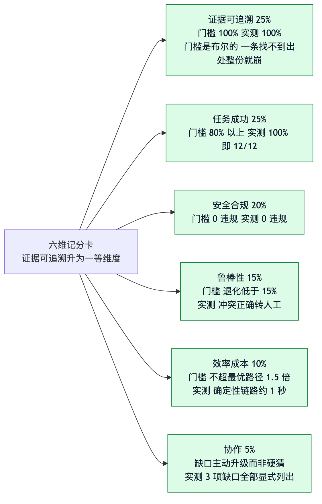
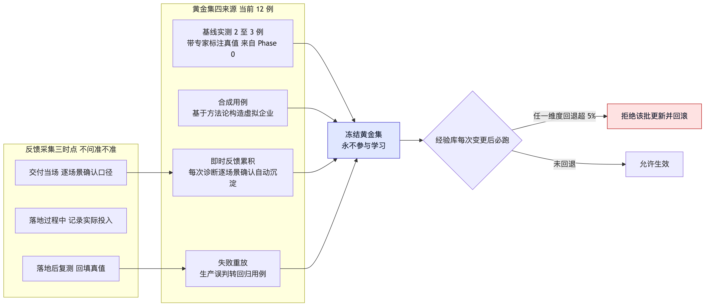
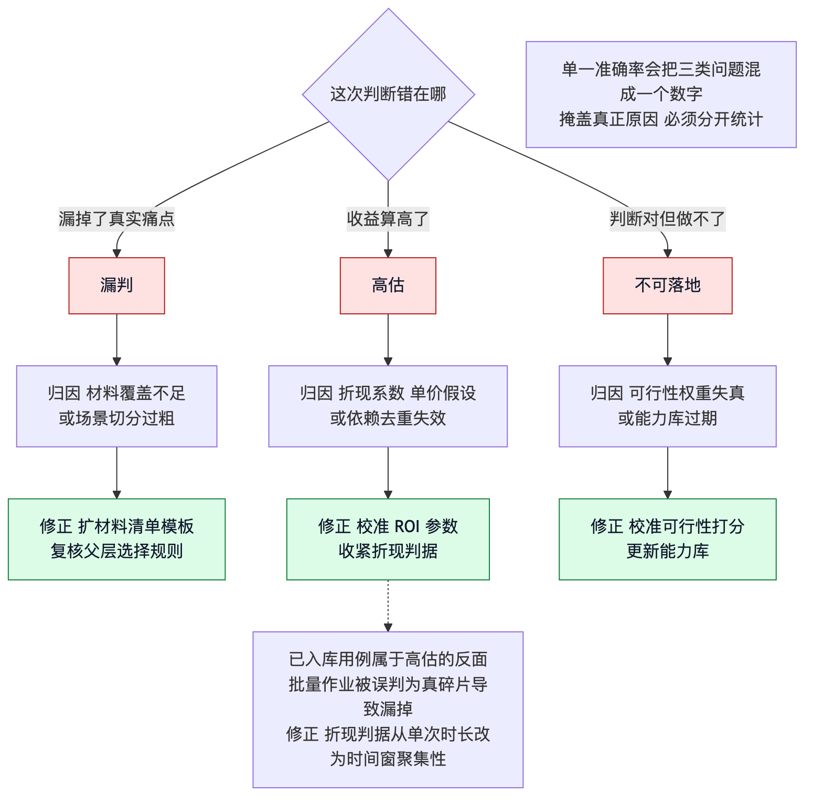

# 06 质量与评测

> 面向测试与质量。当前实测：540 条测试通过、黄金集 12/12、证据可追溯率 100%、注入逃逸 0 次。

## 评测要解决的核心问题

Agent 类系统有一个特有的失效方式：**结论看着对，路径全错。** 模型可以靠堆通用建议
（「上个客服机器人」「用 AI 做报表」）刷高场景召回率，而完全没做过取证。只测最终结论
抓不到这个。

因此评测分两条腿：**结果指标**看产出对不对，**轨迹指标**看过程做没做。两条都过才算通过。

还有一个更隐蔽的问题：本系统最该防的不是答错，而是**在没有数据时给出一个看起来合理的
数字**。所以评测里有一类反向指标：诚实性指标的触发率过低反而告警。

## 六维记分卡

权重按本场景调整过，证据可追溯被升为一等维度（`evals.SCORECARD_WEIGHTS`）。

| 维度 | 权重 | 测法 | 门槛 | 当前实测 |
|---|---|---|---|---|
| 证据可追溯 | 25% | 每条量化声明能否回指证据 | 100% | 100% |
| 任务成功 | 25% | 黄金集场景召回率 | ≥ 80% | 100%（12/12） |
| 安全合规 | 20% | 跨客户泄漏、注入抵抗、越权检索 | 0 违规 | 0 违规 |
| 鲁棒性 | 15% | 脏数据、缺字段、材料互相矛盾下的退化 | 退化 < 15% | 已覆盖，冲突正确转人工 |
| 效率成本 | 10% | 单次 token、时长、成本 | ≤ 最优路径 1.5 倍 | 确定性链路约 1s |
| 协作 | 5% | 缺口是否主动升级而非硬猜 | 无固定门槛 | 3 项缺口全部显式列出 |

证据可追溯门槛定在 100% 而不是 95%，因为这条指标的性质是**布尔的**：只要有一条量化声明
找不到出处，整份报告的可信度就崩了。客户不会觉得「95% 可追溯」是好成绩。

## 轨迹指标

| 指标 | 测什么 | 为什么必要 |
|---|---|---|
| 取证工具调用 F1 | 该调的调了、不该调的没调 | 防止跳过取证直接给结论 |
| 缺数据正确返回率 | 无数据时是否正确返回 `insufficient_data` | 这是防编造的第一道闸 |
| 阶段门禁触发 | 证据不足时是否真的被拦在 S4 外 | 门禁在代码里，但要验证它真的生效 |
| 反评审隔离 | 反评审输入是否确实不含主 Agent 推理链 | 构造式隔离需要断言，否则可能被后续改动破坏 |
| 引用完整性 | 每条声明的引用是否指向真实存在的证据条目 | 防止引用编号本身是编的 |

## 黄金集

原设计要求上线 20 例、规模化 100 例以上。按年频次几十次的量级这不现实，样本根本攒不出来。
修正为四个来源混合，当前 12 例（`evals/golden/cases.json`，`g-001` 至 `g-012`）。

| 来源 | 说明 |
|---|---|
| 基线实测 | 2–3 例带专家标注真值，来自 Phase 0 |
| 合成用例 | 基于方法论构造的虚拟企业场景 |
| 即时反馈累积 | 每次诊断的逐场景确认自动沉淀候选 |
| 失败重放 | 生产误判转回归用例 |

小样本可行是有依据的：反思式优化方法在 3 个样例上就能工作，这正好匹配本场景的现实。

**冻结属性**：黄金集永不参与学习——这是它唯一的价值来源。一份被学习过的评测集无法识别
「学过头」。每次经验库变更后必跑，任一维度回退超 5% 直接拒绝该批更新并回滚。没有这一条，
自学习会静默变坏而指标还在涨。

## 检索质量单独评测

检索有独立的失败面，只测端到端会漏。

| 指标 | 测什么 | 门槛 |
|---|---|---|
| 检索命中率 | 该被召回的黄金片段是否进入候选 | 待标定 |
| 答案忠实度 | 生成的每句是否被召回内容支撑 | 待标定，用模型评审员，不与主 Agent 同源 |
| 无接地正确触发 | 召回为空或全低于阈值时是否正确返回 `no_grounding` | 100% |

第三条是防幻觉的关键：召回不到就必须说没有，绝不许用训练知识补。

## 诚实性指标：反向门槛

这一组指标的判读方式与常规相反，单独说明。

| 指标 | 常规直觉 | 本系统的正确判读 |
|---|---|---|
| 缺数据触发率 | 越低越好 | **过低可疑**，说明在硬编答案 |
| 无接地触发率 | 越低越好 | **过低可疑**，说明在用训练知识补 |
| 冲突转人工次数 | 越少越好 | 长期为 0 可疑，说明冲突检测没生效 |
| 场景标灰数量 | 越少越好 | 全部不标灰可疑，说明验证门禁没生效 |

预置案例的实测值可作参照：缺数据触发 1 次、冲突转人工 1 处、8 个场景中 3 个标灰、
注入检出 1 次逃逸 0 次。**这些非零值本身就是系统在正常工作的证据。**

## 失败三分类

单一「准确率」会把三类完全不同的问题混成一个数字，掩盖真正的原因。三者归因方向与修正
路径都不同，必须分开统计。

| 失败类型 | 含义 | 归因方向 | 修正路径 |
|---|---|---|---|
| 漏判 | 漏掉了真实痛点 | 材料覆盖不足，或场景切分过粗 | 扩材料清单模板；复核父层选择规则 |
| 高估 | 收益算高了 | 折现系数、单价假设、依赖去重失效 | 校准 ROI 参数；收紧折现判据 |
| 不可落地 | 判断对但做不了 | 可行性权重失真，或能力库过期 | 校准可行性打分；更新能力库 |

已入库的失败重放用例属于第二类的反面：批量作业被误判为真碎片，导致该场景被漏掉。
修正方式是把折现判据从「单次时长」改为「时间窗聚集性」。

## 反馈采集的抗偏差设计

反馈是自学习的信号地基。信号错了，自学习会朝错误方向优化，而指标看起来一片大好。

**不问「准不准」。** 客户当面给敷衍好评是这套机制的死穴。改问可验证的具体问题，
用行为而非评价暴露真实判断：

| 不要问 | 改成 |
|---|---|
| 这个判断准不准 | 这个数字比你的实际感受偏高还是偏低 |
| 报告满意吗 | 这三个场景你会先做哪一个 |
| 有帮助吗 | 哪个场景你不会做，为什么 |

排序比打分抗面子偏差强得多，因为排序必须做出取舍，无法一律给好评。

**角色必填。** 老板倾向高估自动化可行性，一线执行者倾向低估收益以保住岗位——两者偏差
方向恰好相反。角色已知则偏差方向已知，可以在自学习中反向校正。同一场景的多条反馈全部
保留，**冲突不合并**，冲突本身是信号。

**三个时点**：即时反馈（交付当时，主力信号）、采纳反馈（两周后）、落地结果（三到六个月后）。
即时反馈零延迟、零归因困难，且样本量等于诊断次数。原设计把唯一信号源放在三到六个月后的
回访上，那是致命依赖。

## 测试分层

| 层 | 测什么 | 手段 | 当前状态 |
|---|---|---|---|
| 单元 | 单个函数的口径正确性 | pytest，29 个模块对应覆盖 | 540 条通过 |
| 契约 | 接口返回结构与错误可执行性 | 接口级测试 | 已覆盖 28 个接口 |
| 端到端 | 建档到报告的全链路 | 三套端到端用例 | 已覆盖 |
| 轨迹 | 取证工具调用的精确率与召回率 | 轨迹断言 | 已覆盖 |
| 黄金集 | 场景召回率，冻结不参与学习 | 12 例回归 | 12/12 通过 |
| 失败重放 | 生产误判的最小复现 | `evals/failure_replays/` | 1 例已入库 |
| 安全 | 注入、越权、跨客户、只读边界 | 专项断言 | 已覆盖 |
| 界面 | 14 视图 × 5 档宽度、对比度、键盘可达 | 浏览器实测 + 静态钉子 | 70 种组合 |

**非确定性处理**：模型输出不稳定，涉及 LLM 的用例不进主流水线，避免模型抖动造成假失败；
改为预发跑 3 次，安全项必须 3 次全过。这不是放松要求，而是把不同性质的验证放在合适的位置。

**红绿验证**：静态钉子本身也要验证——逐个破坏被保护的行为，确认对应测试真的会红。
详见 [04 结论纪律](04-结论纪律.md)。

## 持续集成门禁

| 门禁项 | 要求 | 阻断 |
|---|---|---|
| 单元与集成测试 | 540 条全过 | 是 |
| 黄金集回归 | 12/12，任一维度不得回退超 5% | 是 |
| 安全专项 | 注入、越权、跨客户、只读边界 0 违规 | 是 |
| 界面静态钉子 | 术语一致性、内部词扫描、对比度配对 | 是 |
| 失败重放 | 已入库用例全过 | 是 |
| 非确定性用例 | 预发跑 3 次，安全项 3 次全过 | 仅预发阻断 |

## 代码层强制的质量红线

完整清单见 [04 结论纪律](04-结论纪律.md)。这些不是提示词里的叮嘱，是测试锁死的行为。
