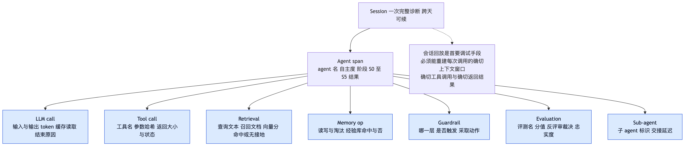
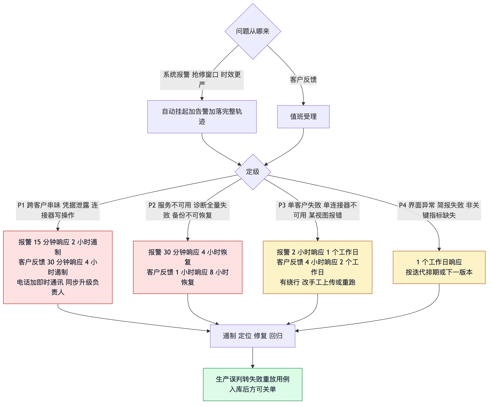

# 08 运维

> 面向运维与值班。观测标准采用 OpenTelemetry GenAI 语义约定（`gen_ai.*`, semconv 1.44），
> 不自造字段，任何观测后端可直接接入。

## 部署形态

单实例 Python 服务 + 本地文件系统。**无数据库、无向量库、无消息队列**——这不是简化，
而是架构决策的结果：状态唯一真相源在盘上，客户原始数据不进任何索引。

| 项 | 建议 |
|---|---|
| 节点数 | 1（生产建议 2，主备） |
| CPU / 内存 | 4 核 / 8GB |
| 系统盘 | ≥ 50GB SSD |
| 数据盘（客户工作区） | ≥ 200GB SSD |
| 轨迹与日志盘 | ≥ 100GB |
| 出网 / 入网 | ≥ 10Mbps |

配置基于在服客户 5–10 家、单客户材料 100–500MB、日诊断 1–3 次、轨迹保留 12 个月推算。

出网目标：模型网关（必需）、客户业务系统只读接口（L1 连接器，按客户配置）、公开信息源
（可关闭）、观测后端。入网只有顾问访问，**建议限制来源网段，且必须在代理层加认证**
（见 [07 安全与合规](07-安全与合规.md)）。

> **代理环境注意**：存在 SOCKS 代理时必须安装 `httpx[socks]`（已写入依赖），否则请求在
> 传输层就失败。这个错误曾被上层的宽泛异常捕获伪装成「模型没话说」，排查成本很高。

## 容量上限

| 维度 | 上限 |
|---|---|
| 在服客户数 | 50 家（单实例） |
| 单客户材料总量 | 500MB |
| 单文件 / 单批 | 20MB / 40 份（超出直接拒收） |
| 单客户场景卡 | 30 张（实测案例 8 张） |
| 单次解析记录数 | 10 万条 |
| 经验库条目 | 150 条硬上限 |
| 并发诊断 | 3 个（受模型网关限流约束） |
| 单客户轨迹保留 | 12 个月，不可变存储 |

## 性能基线

模型调用是唯一的慢环节，因此设计上把它移出关键路径：场景卡的频次、耗时、作业形态、
证据等级、ROI 全部由确定性代码算出，模型只负责命名与文本生成。

| 项 | 目标 | 实测 |
|---|---|---|
| 确定性诊断（不调模型） | ≤ 5s | 预置案例约 1s |
| 含模型诊断 | ≤ 3min | 受模型网关延迟约束 |
| 报告单视图接口 | 平均 60ms，繁忙 200ms | — |
| 视图切换（命中缓存） | 平均 120ms | — |
| 材料单文件解析（≤20MB） | 平均 1.5s，繁忙 5s | — |
| 连接器单次拉取 | 平均 3s，繁忙 15s | — |
| 全量测试 | — | 540 条 / 2.4s |
| 黄金集回归 | — | 12 例 / < 1s |

**模型不可用时系统仍能出报告**，因为数字全部由确定性代码算出。这是「模型只负责命名」这个
决策带来的容灾收益。

成本：单次含模型诊断实测约 9 元。熔断上限单次会话 6 美元、每小时 20 美元。

## 轨迹结构

每次诊断一棵树，跨天可续。**会话回放是首要调试手段**：必须能重建每次模型调用时的确切上
下文窗口、生成的确切工具调用、返回的确切结果。没有回放，调试只能靠指标猜。

## 监控项

### 系统健康

| 报警 | 指标 | 阈值 | 客户侧影响 |
|---|---|---|---|
| `DiagnoseLatencyHighAlert` | `diagnose_duration_seconds` | 确定性诊断 > 15s，持续 5min | 顾问点诊断后长时间无结果 |
| `ApiErrorRateHighAlert` | `api_error_rate` | 5xx > 2%，持续 5min | 报告页打不开 |
| `CostBreakerTrippedAlert` | `breaker_tripped_count` | 单次触发即报 | 该次诊断被挂起，需人工介入 |
| `CacheHitRateDropAlert` | `cache_hit_rate` | < 40%，持续 30min | 无直接影响，但成本可能翻数倍 |
| `LLMGatewayErrorAlert` | `llm_error_rate` | > 10%，持续 5min | 场景命名与反评审降级为规则回退 |
| `WorkspaceDiskHighAlert` | `disk_used_ratio` | > 85%，持续 10min | 材料上传失败 |
| `BackupVerifyFailedAlert` | `backup_anchor_check` | 校验失败即报 | 无即时影响，但数据不可恢复 |

### 质量与诚实性

| 报警 | 指标 | 阈值 | 客户侧影响 |
|---|---|---|---|
| `TraceabilityBelowFullAlert` | `evidence_traceability` | < 100% 即报 | 报告有声明找不到出处 |
| `HonestySignalTooLowAlert` | `insufficient_data_count` | 连续 10 次诊断为 0 | 可能在硬编答案，数字不可信 |
| `NoGroundingTooLowAlert` | `no_grounding_count` | 连续 10 次诊断为 0 | 可能在用训练知识补 |
| `ConflictNeverEscalatedAlert` | `conflicts_escalated` | 连续 30 天为 0 | 冲突检测可能失效，分歧被掩盖 |
| `InjectionEscapedAlert` | `injection_escaped` | > 0 即报 | 客户材料中的指令可能影响了结论 |
| `CrossTenantAccessAlert` | `tenant_filter_missing` | > 0 即报 | **最高危**，客户数据可能串味 |
| `GoldenSetRegressionAlert` | `golden_pass_rate` | < 100% 或任一维度回退 > 5% | 该批经验库更新被阻断 |
| `PlaybookDegradationAlert` | `counterexample_count` | 单条目反例达 2 次 | 该经验转试用，可能已在影响结论 |

诚实性那四条的判读方式与常规相反，值得再强调：**触发率为 0 不是好消息。** 缺数据从不触发
说明模型在硬编答案，冲突从不升级说明检测没生效。这是本系统最该盯的信号。

## 三个本系统定制的观测重点

**幻觉可观测**：缺数据、无接地、无法回指证据被拦截三者做成一等指标。

**自学习可观测**：每次经验库变更发部署事件，附版本号与黄金集回归结果。任一维度回退超 5%
自动告警并阻断该批更新。没有这一条，自学习会静默变坏而指标还在涨。

**成本可观测**：按诊断类型与阶段拆分，配单次会话与每小时双档熔断。缓存命中率单独看——
系统提示带时间戳或客户名会击穿缓存，成本差可达 10 倍，这个指标能第一时间抓到，且它的
异常下降会**先于**成本超支出现。

## 自然语言简报

内部越严谨，对外越自然语言。观测有两套出口：完整轨迹、原始指标、会话回放属于内部后台，
只给运维与研发看；给顾问的是自然语言简报；给客户的只有一句话式进度。

简报四个固定部分：顺利的部分、需要你看一眼的、系统自己的问题、花费。当前预置案例的实际
输出：

> 昨天跑了 1 家诊断。顺利的部分：明辉家居建材的材料比较齐全，8 个环节里有 5 个拿到了扎实
> 数据。需要你看一眼的：明辉家居建材有 3 个环节因为缺少销售台账导出只能给方向性判断，
> 建议再向他们要一份这个导出；有 1 处客户说法和系统记录不一致，需要你拍板。
> 花费：合计约 9 元，比平均水平略高，原因是材料批次偏多、存在重复解析。

给客户的进度只有一句话，不暴露任何内部阶段与逻辑。告警也自然语言化：不是「忠实度低于
0.7」，而是「报告里有 2 句话找不到证据支撑，已自动标灰，建议你复核第 3 节」。

## 必发事件

工具调用起止与失败、护栏触发（哪层 + 动作）、熔断跳闸、人工审批请求与通过/拒绝/超时、
经验库候选提交与合并、检索返回无接地、**用户当场反驳**、定期检索周期执行结果。

用户当场反驳是高价值纠错信号，直连单次内反思回路。「这个数字不对，我们哪有那么多」不是
闲聊，它应该触发重新取证。

## 故障分级

| 级别 | 描述 |
|---|---|
| P1 | 跨客户数据串味、凭据泄露、连接器发生写操作。影响超出单客户，无绕行方案，涉及合同违约风险 |
| P2 | 服务整体不可用、诊断接口全量失败、备份不可恢复。影响全部顾问，无绕行方案 |
| P3 | 单客户诊断失败、单连接器不可用、报告某视图报错。影响单客户，有绕行方案 |
| P4 | 界面显示异常、简报生成失败、非关键指标缺失。不影响结论正确性 |

**系统报警触发**（更严，因为问题还没被客户发现，这是抢修窗口）：

| 级别 | 初始响应 | 处理 |
|---|---|---|
| P1 | 15 分钟 | 2 小时内遏制，自动挂起 + 值班电话 |
| P2 | 30 分钟 | 4 小时内恢复 |
| P3 | 2 小时 | 1 个工作日 |
| P4 | 1 个工作日 | 按迭代排期 |

**客户反馈触发**：P1 30 分钟响应 / 4 小时给遏制方案；P2 1 小时 / 8 小时恢复；
P3 4 小时 / 2 个工作日；P4 1 个工作日 / 下一版本。

## 熔断处置

熔断动作是**挂起 + 告警 + 落完整轨迹**，不是静默降级。阈值定为正常单次诊断成本的 3–5 倍，
作用是捕捉异常而非压成本——正常诊断不该触发。

熔断触发一律视为**待排查缺陷**，进事件流并要求归因，不允许简单提高阈值了事。常见成因三类：
材料重复解析、检索死循环、反评审震荡。首批 10 次诊断后用实测 p95 重新标定阈值。

## 备份与恢复

| 项 | 策略 |
|---|---|
| 频率 | 每日全量 + 增量 |
| 范围 | 客户工作区、报告、证据台账、基线、轨迹 |
| 校验 | **锚点文件清单校验** |
| RPO / RTO | 24 小时 / 2 小时 |
| 演练 | 每季度一次完整恢复 |

锚点校验这一步不能省：备份命令返回成功但内容缺失是很常见的失效方式，只有对着清单逐项核对
才能发现。新增数据类型时必须同步扩展锚点清单。

## 高可用与降级

| 机制 | 形态 |
|---|---|
| 状态持久化 | 全部中间产物落盘，会话可丢弃重建，中断后从落盘状态继续不重跑 |
| 阶段级恢复 | 每次恢复先读盘重建，不依赖历史上下文 |
| 模型网关故障 | 降级为确定性诊断，场景命名用规则回退，**不阻断主流程** |
| 连接器故障 | 返回结构化错误，L0 材料仍可用，双轨互为兜底 |
| 熔断触发 | 挂起 + 告警 + 落完整轨迹 |

## 常见故障与处置

| 现象 | 可能原因 | 处置 |
|---|---|---|
| 诊断返回 409 | 无可用材料 | **正常行为**，按返回的下一步补材料 |
| 效果接口返回 422 | 无改造前基线 | **正常行为**，先补基线 |
| 模型「没话说」 | 传输层失败被宽泛异常吞掉 | 检查代理环境与 socks 依赖，看原始异常 |
| 连接器数据每次重启都变 | 种子用了内置 `hash()` | 已修为 blake2b，若复现检查是否引入新的哈希调用 |
| 界面显示旧的分级数字 | 前端另写了一份真值 | 分级标准只有一处真值，检查是否绕过统一取值 |
| 缺数据指标长期为 0 | 模型在硬编答案 | 按诚实性告警排查，**不是好消息** |
| 上传文件被拒 | 含宏、类型不在白名单、超限 | 正常行为，按提示换格式 |

前两条要特别说明：**409 与 422 是设计意图，不是错误。** 系统宁可返回一个带可执行下一步的
拒绝，也不给一个看起来合理的编造结果。值班时不要把它们当故障去「修」。

## 发布流程

1. 全量测试 540 条通过
2. 黄金集 12/12，任一维度不得回退超 5%
3. 安全专项 0 违规
4. 涉及冻结区的变更须**人工批准并走版本发布**
5. 发布后验证：预置案例可跑通，14 个视图可打开
6. 经验库变更须发部署事件并附回归结果

## 值班检查清单

**每日**：看自然语言简报，确认没有需要人工拍板的冲突项积压；看诚实性四项指标是否有长期
为 0 的；看成本与缓存命中率；确认备份成功且锚点校验通过。

**每周**：抽查一份报告的证据台账，随机核对 2 条声明能否追溯到原始记录；看缺口分布，判断
是否有系统性的材料获取障碍；看反馈采集量与角色分布。

**每月**：经验库条目复查（试用转生效的转化率、反例分布）；抽样审计模型生成的场景命名与
反评审文本；复核连接器模板的待核对项。

**每季**：完整恢复演练；能力库更新（主流模型有重大发布时额外触发）；熔断阈值按实测 p95
重新标定。
